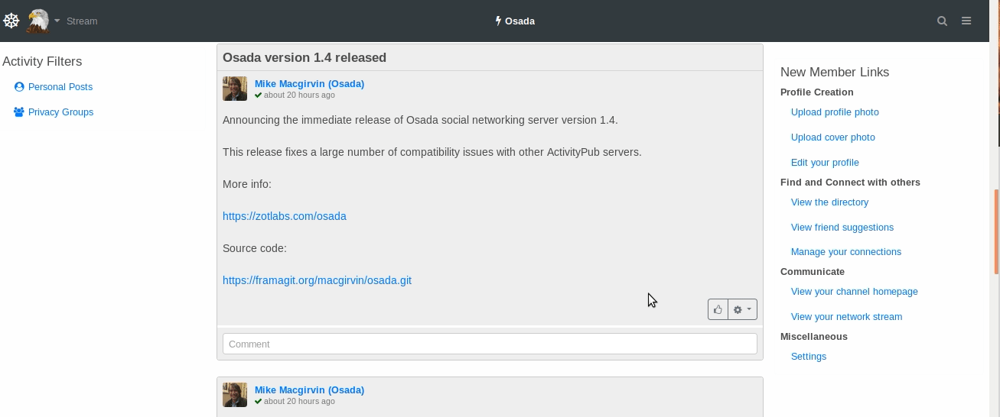

<!--
N.B.: This README was automatically generated by https://github.com/YunoHost/apps/tree/master/tools/README-generator
It shall NOT be edited by hand.
-->

# Osada pour YunoHost

[](https://dash.yunohost.org/appci/app/osada)  

[](https://install-app.yunohost.org/?app=osada)

*[Read this readme in english.](./README.md)*

> *Ce package vous permet d’installer Osada rapidement et simplement sur un serveur YunoHost.
Si vous n’avez pas YunoHost, regardez [ici](https://yunohost.org/#/install) pour savoir comment l’installer et en profiter.*

## Vue d’ensemble

## Overview
[Osada](http://zotlabs.com/osada/) uses **Zot6 protocol** which is next version of **zot5 protocol**. Osada has native support for the **ActivityPub protocol** (W3C standard) as well as the more advanced features. It can inter-operate with other social networking applications and projects in either of these spaces, including **Mastodon, Pleroma, Pixelfed, PeerTube, Funkwhale, Zap, Friendica, Hubzilla,** and many more.

**Version incluse :** 23.12.17~ynh1

## Captures d’écran



## Avertissements / informations importantes

## This app claims following features:
- [X] LDAP integration
- [X] Multi-instance
- [X] Adeed php.log in the root folder for debugging PHP, with logrotate applied on it (can be accesssed by **admin->logs** and entering the **php.log**).
- [X] Fail2Ban
- [X] Option to choose between **Mysql** and **PostgreSQL** for the Osada

## Ldap Admin user rights, logs and failed database updates

- **For admin rights**: When installation is complete, you will need to visit your new hub's page and login with the **admin account username** which was entered at the time of installation process. You should then be able to create your first channel and have the **admin rights** for the hub.

- **For normal YunoHost users**: Normal LDAP users can login through LDAP authentication and create there channels.

- **Failing to get admin rights**: If the admin cannot access the admin settings at `https://osada.example.com/admin` then you have to **manually add 4096** to the **account_roles** under **accounts** for that user in the **database through phpMyAdmin**.

- **For logs**: Go to **admin->logs** and enter the file name **php.log**.

- **Failed Database after Upgrade:** Some times databse upgrade fails after version upgrade. You can go to hub eg. `https://osada.example.com/admin/dbsync/` and check the numbers of failled update. These updates will have to be ran manually by **phpMyAdmin**.

## :red_circle: Fonctions indésirables

- **Upstream not maintained**: This software is not maintained anymore. Expect it to break down over time, be exposed to unfixed security breaches, etc.

## Documentations et ressources

* Site officiel de l’app : <http://zotlabs.com/osada/>
* Dépôt de code officiel de l’app : <https://codeberg.org/zot-archive/osada>
* YunoHost Store: <https://apps.yunohost.org/app/osada>
* Signaler un bug : <https://github.com/YunoHost-Apps/osada_ynh/issues>

## Informations pour les développeurs

Merci de faire vos pull request sur la [branche testing](https://github.com/YunoHost-Apps/osada_ynh/tree/testing).

Pour essayer la branche testing, procédez comme suit.

``` bash
sudo yunohost app install https://github.com/YunoHost-Apps/osada_ynh/tree/testing --debug
ou
sudo yunohost app upgrade osada -u https://github.com/YunoHost-Apps/osada_ynh/tree/testing --debug
```

**Plus d’infos sur le packaging d’applications :** <https://yunohost.org/packaging_apps>